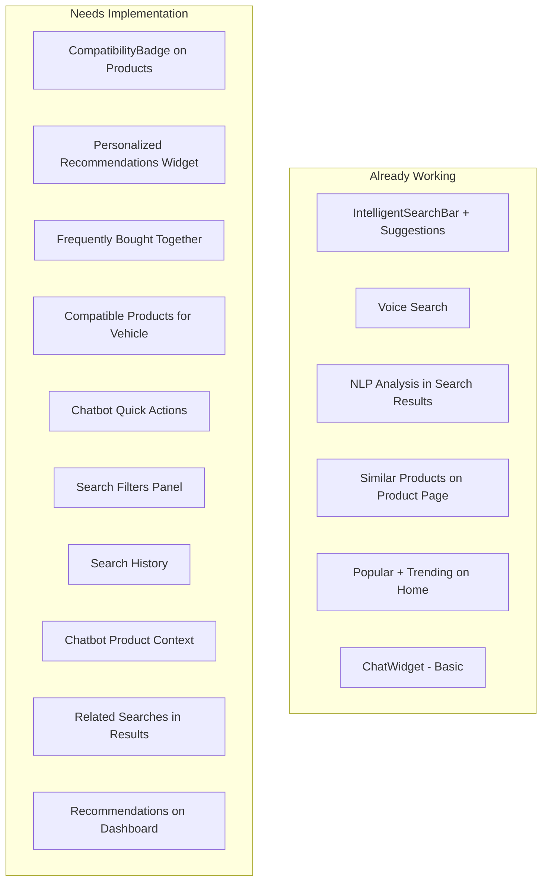
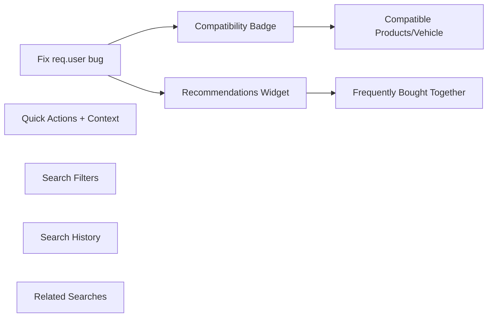

# Complete All Customer AI Features

## Current State Analysis

The backend has **6 AI services** fully implemented (NLP processor, AI search, ranking, compatibility, recommendations, chatbot). The frontend is partially connected. Here is what is missing:

---

## Feature 1: Compatibility Badge and Auto-Check

**Why:** This is the core value proposition of the platform. When a logged-in user has registered vehicles, every product should show whether it fits their car.

**Approach:**

- Create `CompatibilityBadge.jsx` component in `frontend/src/components/products/`
- Shows green check (compatible), red X (not compatible), or gray question mark (no vehicle registered)
- Integrate into `ProductCard.jsx` - auto-check when user has vehicles
- On `ProductDetailsPage.jsx` - add a prominent compatibility section with a dropdown to select which vehicle to check against
- Use `aiSearchService.checkCompatibility(productId, vehicleId)` which calls `POST /api/ai/compatibility`
- For performance: batch check via the search results (backend already adds compatibility info when user is logged in)

**Files to modify:**

- Create: `[frontend/src/components/products/CompatibilityBadge.jsx](frontend/src/components/products/CompatibilityBadge.jsx)`
- Modify: `[frontend/src/components/products/ProductCard.jsx](frontend/src/components/products/ProductCard.jsx)` - add badge
- Modify: `[frontend/src/pages/ProductDetailsPage.jsx](frontend/src/pages/ProductDetailsPage.jsx)` - add vehicle selector + check
- Need: Access to user's vehicles (via `vehicleService` or a new `VehicleContext`)

---

## Feature 2: Personalized Recommendations Widget

**Why:** Personalized recommendations increase engagement and conversion. The backend already supports this via `/api/ai/recommendations`.

**Approach:**

- Create `RecommendedProducts.jsx` in `frontend/src/components/products/`
- A reusable section that fetches `aiSearchService.getRecommendations({ vehicleId, limit })` 
- Show on **HomePage** (below trending, when logged in) with title "Recommended For Your [Vehicle Name]"
- Show on **DashboardPage** as a "Recommended For You" section
- Falls back to popular products when not logged in or no vehicles

**Files to modify:**

- Create: `[frontend/src/components/products/RecommendedProducts.jsx](frontend/src/components/products/RecommendedProducts.jsx)`
- Modify: `[frontend/src/pages/HomePage.jsx](frontend/src/pages/HomePage.jsx)` - add recommendations section
- Modify: `[frontend/src/pages/DashboardPage.jsx](frontend/src/pages/DashboardPage.jsx)` - add recommendations

---

## Feature 3: Frequently Bought Together

**Why:** Classic e-commerce upsell feature. Backend already has `/api/ai/frequently-bought-together/:productId`.

**Approach:**

- Create `FrequentlyBoughtTogether.jsx` in `frontend/src/components/products/`
- Shows on `ProductDetailsPage.jsx` between product details and similar products
- Display as horizontal cards with "Add all to cart" button
- Uses `aiSearchService.getFrequentlyBoughtTogether(productId, 4)`

**Files to modify:**

- Create: `[frontend/src/components/products/FrequentlyBoughtTogether.jsx](frontend/src/components/products/FrequentlyBoughtTogether.jsx)`
- Modify: `[frontend/src/pages/ProductDetailsPage.jsx](frontend/src/pages/ProductDetailsPage.jsx)` - add section

---

## Feature 4: Compatible Products for Vehicle

**Why:** After a user registers their vehicle, they want to browse ALL parts that fit. Backend has `/api/ai/compatible-products/:vehicleId`.

**Approach:**

- Add a "Browse Compatible Parts" section/button on `[frontend/src/pages/VehiclesPage.jsx](frontend/src/pages/VehiclesPage.jsx)`
- When user clicks on a vehicle, show compatible products grid with category filter
- Uses `aiSearchService.getCompatibleProducts(vehicleId, { category, page, limit })`
- Could also be a dedicated route like `/vehicles/:id/parts` or a modal/expandable section

**Files to modify:**

- Modify: `[frontend/src/pages/VehiclesPage.jsx](frontend/src/pages/VehiclesPage.jsx)` - add compatible products section

---

## Feature 5: Chatbot Quick Actions + Product Context

**Why:** Quick actions improve UX by giving users pre-built questions. Product context makes the chatbot aware of what the user is currently viewing.

**Approach:**

- **Quick Actions:** Fetch from `chatbotService.getQuickActions('en')` when chat opens
- Display as clickable chips/buttons below the welcome message (e.g., "Find parts for my car", "Check compatibility", "Shipping info", "Return policy")
- **Product Context:** When user is on `ProductDetailsPage`, pass `context: { productId }` to `chatbotService.sendMessage()`
- Use React Router's `useLocation` to detect current page and product ID

**Files to modify:**

- Modify: `[frontend/src/components/chatbot/ChatWidget.jsx](frontend/src/components/chatbot/ChatWidget.jsx)` - add quick actions + context

---

## Feature 6: Advanced Search Filters Panel

**Why:** Users need to refine AI search results by price, brand, stock, rating, category.

**Approach:**

- Create `SearchFilters.jsx` in `frontend/src/components/search/`
- Collapsible sidebar or top-bar filter panel
- Filters: Brand (checkboxes for supported brands), Price Range (min/max inputs or slider), In Stock toggle, Min Rating (stars), Category dropdown
- Filters are passed to `aiSearchService.intelligentSearch()` which already supports them in backend
- Update `SearchResultsPage.jsx` to include the filter panel and pass filters to search

**Files to modify:**

- Create: `[frontend/src/components/search/SearchFilters.jsx](frontend/src/components/search/SearchFilters.jsx)`
- Modify: `[frontend/src/pages/SearchResultsPage.jsx](frontend/src/pages/SearchResultsPage.jsx)` - integrate filters

---

## Feature 7: Search History

**Why:** Users want to quickly re-run previous searches.

**Approach:**

- Store recent searches in `localStorage` (max 10 items)
- Show in `SearchSuggestions.jsx` dropdown under "Recent Searches" section (already has placeholder)
- Add clear history button
- Create a small utility or hook `useSearchHistory` for localStorage management

**Files to modify:**

- Create: `[frontend/src/hooks/useSearchHistory.js](frontend/src/hooks/useSearchHistory.js)`
- Modify: `[frontend/src/components/search/IntelligentSearchBar.jsx](frontend/src/components/search/IntelligentSearchBar.jsx)` - save searches
- Modify: `[frontend/src/components/search/SearchSuggestions.jsx](frontend/src/components/search/SearchSuggestions.jsx)` - show history

---

## Feature 8: Related Searches in Results

**Why:** Help users discover related products when their initial search doesn't fully match.

**Approach:**

- After search completes on `SearchResultsPage`, call `aiSearchService.getRelatedSearches(query, 'en')`
- Show as clickable chips below the NLP analysis card
- Each chip navigates to a new search with that query

**Files to modify:**

- Modify: `[frontend/src/pages/SearchResultsPage.jsx](frontend/src/pages/SearchResultsPage.jsx)` - add related searches section

---

## Bug Fix: req.user.userId in AI Controller

The backend `[backend/src/controllers/aiSearchController.js](backend/src/controllers/aiSearchController.js)` uses `req.user.userId` but auth middleware sets `req.user._id`. This must be fixed for personalized features (recommendations, compatibility with user vehicles) to work.

**Files to modify:**

- Modify: `[backend/src/controllers/aiSearchController.js](backend/src/controllers/aiSearchController.js)` - change `req.user.userId` to `req.user._id`

---

## Implementation Order (by priority and dependency)

1. **Bug fix** (req.user._id) - prerequisite for all user-specific AI features
2. **Compatibility Badge** - core value, highest impact
3. **Personalized Recommendations** - high engagement
4. **Frequently Bought Together** - upsell on product page
5. **Compatible Products for Vehicle** - depends on compatibility working
6. **Chatbot Quick Actions + Context** - independent, improves chatbot
7. **Search Filters** - independent, improves search UX
8. **Search History** - independent, improves search UX
9. **Related Searches** - independent, low effort

---

## Summary: 9 tasks, ~15 files to create/modify

All backend APIs already exist. The work is primarily:

- 4 new frontend components
- 1 new custom hook
- 6 existing pages/components to enhance
- 1 backend bug fix

